# HRSID
High resolution sar images dataset (HRSID) is a data set for ship detection, semantic segmentation, and instance segmentation tasks in high-resolution SAR images. This dataset contains a total of 5604 high-resolution SAR images and 16951 ship instances. HRSID dataset draws on the construction process of the Microsoft Common Objects in Context (COCO) datasets, including SAR images with different resolutions, polarizations, sea conditions, sea areas, and coastal ports. This dataset is a benchmark for researchers to evaluate their approaches. For HRSID, the resolution of SAR images is as follows: 0.5m, 1 m, and 3 m.

### Visualization results

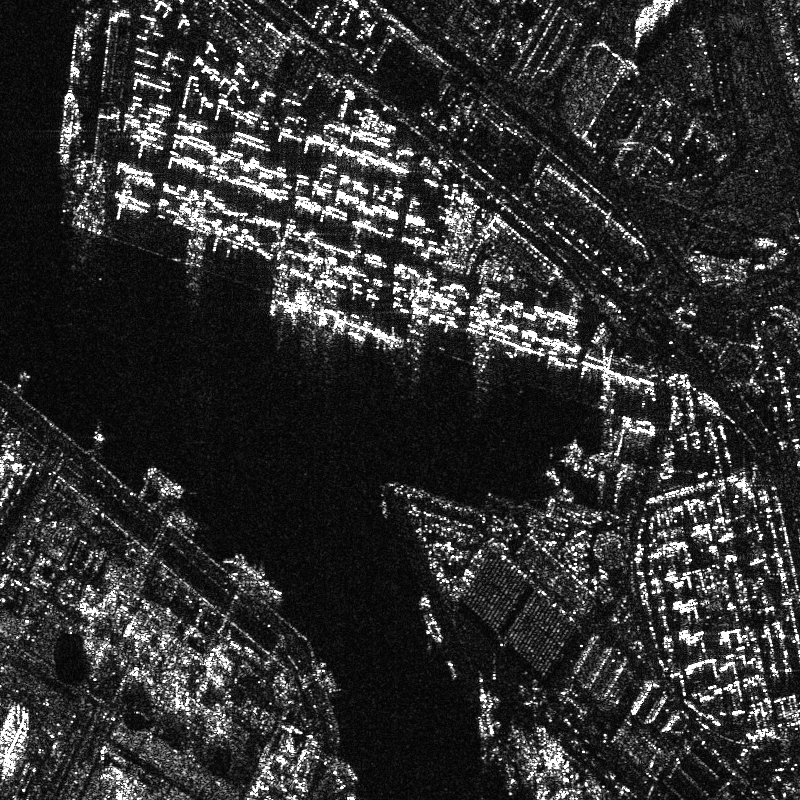
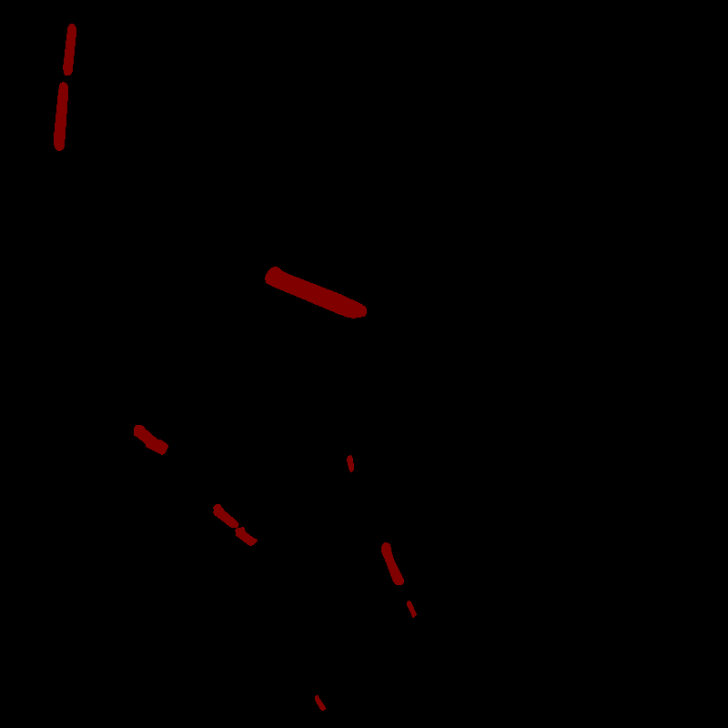
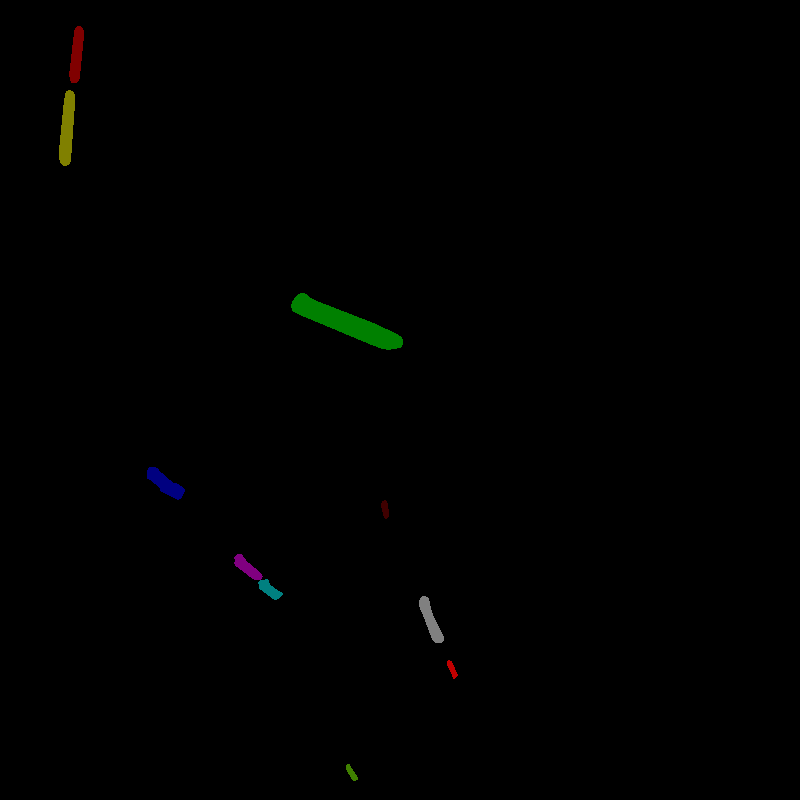

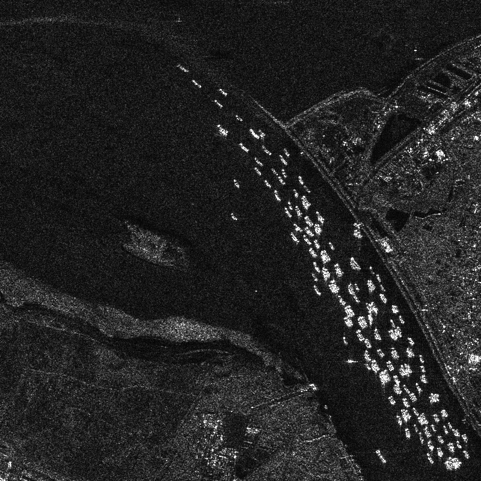
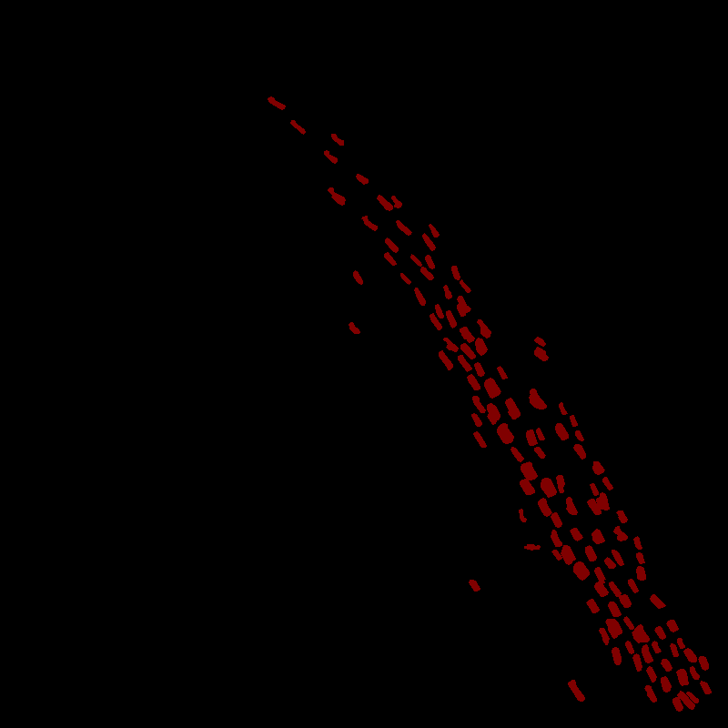
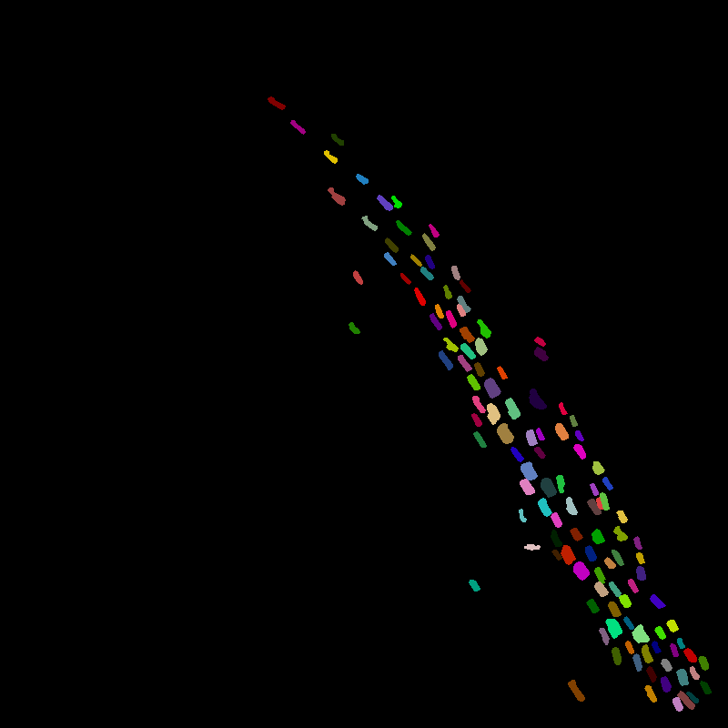

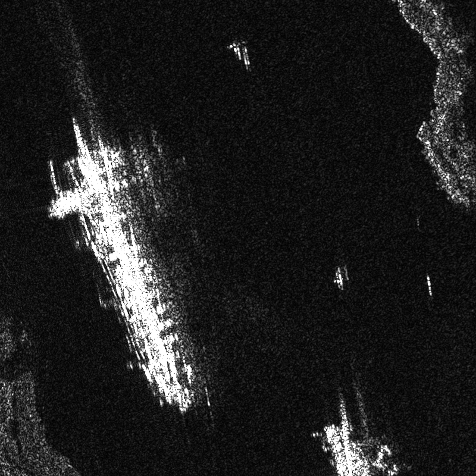
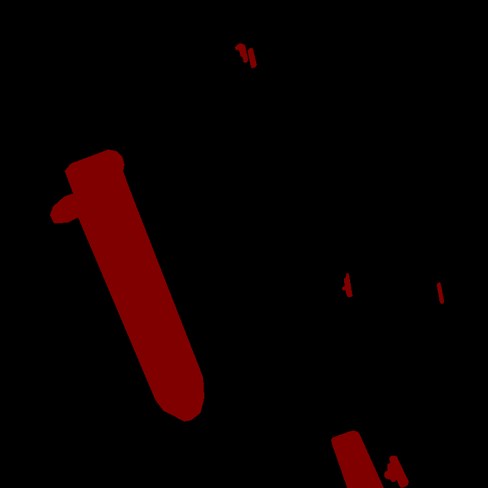
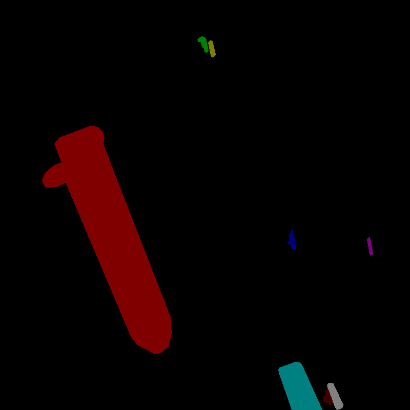

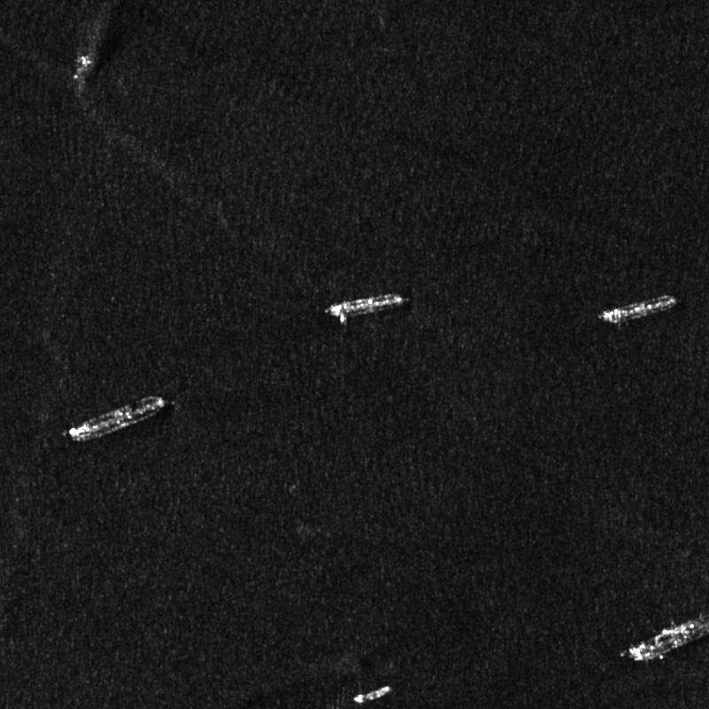
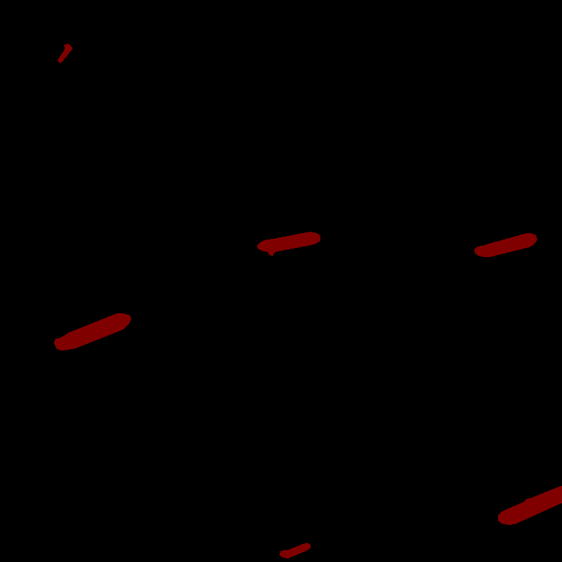

### Statistical results

#### Dataset download link

HRSID dataset(JPG) can be downloaded from URL: [Baidu cloud](https://pan.baidu.com/s/1z0-E3Lwdkg14feu1FwRf3g)  Extraction code: bs64
 and [Google cloud](https://drive.google.com/open?id=1BZTU8Gyg20wqHXtBPFzRazn_lEdvhsbE).

HRSID can be downloaded from Google Cloud:
Compared to the latest released version of jpg format images of HRSID, we have added the annotations for inshore and offshore ships. Statistically, inshore scenes occupy the proportion of 18.4%, and offshore scenes occupy the proportion of 81.6%. It can be downloaded from URL
https://drive.google.com/file/d/1NY3ovgc-woDlNoQdyqzRB3t9McOBH5Ms/view?usp=sharing

As full negative SAR images can provide the information of land or sea clutter, we have prepared 400 SAR images with pure background for testing the robustness of the trained model. It can be downloaded from the URL
https://drive.google.com/file/d/1U0Sj1SHoq-2VjXXUKwpXae6rBI3YjyDP/view?usp=sharing

Here is the other version HRSID with png format images. It takes up much more storage space than the version of HRSID with jpg format images, while the high-fidelity SAR images are stored here. This version can be downloaded from the URL:
https://drive.google.com/file/d/1xgXi8KC3MDWuu7Yp4n2J-LOPYLRszHAc/view?usp=sharing

HRSID can be downloaded from Baidu Cloud:
The files can also be downloaded from URL:Baidu cloud. Extraction code: vxrs
https://pan.baidu.com/s/1EitHYJ7tpGh0q9Qb3QA5SQ

If you have any problem, please contact me by email：chaozhong2010@163.com

### Citation

If you feel this dataset is useful, please cite as the following format.

[1] Shunjun Wei ; Xiangfeng Zeng ; Qizhe Qu ; Mou Wang ; Hao Su ; Jun Shi. [HRSID: A High-Resolution SAR Images Dataset for Ship Detection and Instance Segmentation](https://ieeexplore.ieee.org/stamp/stamp.jsp?tp=&arnumber=9127939
) . IEEE Access
